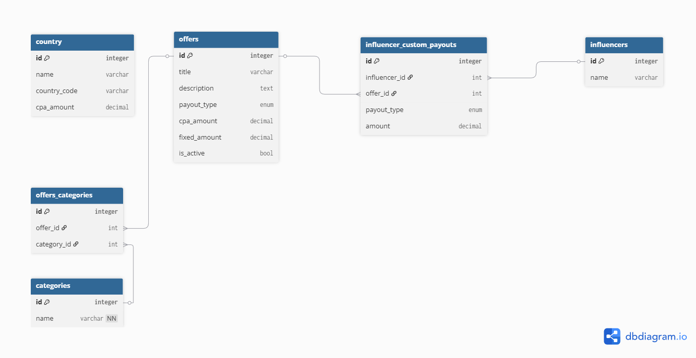

# Assignment for Full Stack Developer (Back-end focus)
Offers are used to promote specific products on behalf of brands or advertisers.
Influencers can browse available offers and see how they would be paid for promoting
them.
The goal of this assignment is to design and implement a small system that models
this domain, exposes it via an API, and presents the results in a simple UI.

## Database Structure


## Prerequisites

- [Docker](https://docs.docker.com/get-docker/) (version 20.10 or higher)
- [Docker Compose](https://docs.docker.com/compose/install/) (version 2.0 or higher)


1. **Clone the repository** (if you haven't already):
   ```bash
   git clone https://github.com/naveenkumarkk/adcash.git
   cd adcash
   ```

2. **Create environment file** (optional):
   ```bash
   cp .env.example .env
   ```
   Modify `.env` if you need custom configuration.

3. **Start all services**:
   ```bash
   docker-compose up -d
   ```

   This will start:
   - PostgreSQL database on `localhost:5432`
   - Backend API on `http://localhost:8000`
   - Frontend application on `http://localhost:5173`

4. **View logs**:
   ```bash
   # All services
   docker-compose logs -f

   # Specific service
   docker-compose logs -f backend
   docker-compose logs -f frontend
   docker-compose logs -f db
   ```

5. **Stop all services**:
   ```bash
   docker-compose down
   ```

6. **Stop and remove volumes** (deletes database data):
   ```bash
   docker-compose down -v
   ```

7. **Access the application**:
   - Frontend: `http://localhost`
   - Backend API: `http://localhost:8000`
   - API Docs: `http://localhost:8000/docs`

## Common Commands

### View running containers
```bash
docker-compose ps
```

### Restart a specific service
```bash
docker-compose restart backend
docker-compose restart frontend
```

### Rebuild containers
```bash
docker-compose up -d --build
```

### Execute commands in a container
```bash
# Backend shell
docker-compose exec backend /bin/bash

# Run database migrations
docker-compose exec backend alembic upgrade head

# Frontend shell
docker-compose exec frontend /bin/sh
```

### Database Management

#### Access PostgreSQL
```bash
docker-compose exec db psql -U postgres -d adcash
```


## Service URLs

- **Frontend**: http://localhost:5173
- **Backend API**: http://localhost:8000
- **API Documentation**: http://localhost:8000/docs
- **ReDoc**: http://localhost:8000/redoc
- **Database**: localhost:5432

## Troubleshooting

### Port already in use
If you get an error that a port is already in use, you can:
1. Stop the conflicting service
2. Change the port mapping in `docker-compose.yml`:
   ```yaml
   ports:
     - "8001:8000"  # Maps host port 8001 to container port 8000
   ```

### Database connection issues
```bash
# Check if database is healthy
docker-compose ps

# View database logs
docker-compose logs db

# Restart database
docker-compose restart db
```

### Frontend not loading
```bash
# Check frontend logs
docker-compose logs frontend

# Rebuild frontend
docker-compose up -d --build frontend
```

### Backend errors
```bash
# Check backend logs
docker-compose logs backend

# Restart backend
docker-compose restart backend

# Access backend shell for debugging
docker-compose exec backend /bin/bash
```

### Clear everything and start fresh
```bash
# Stop all containers
docker-compose down -v

# Remove all images
docker-compose down --rmi all

# Rebuild and start
docker-compose up -d --build
```


### Running Tests
```bash
docker-compose exec backend pytest
```

## Environment Variables

### Backend (.env or docker-compose.yml)
- `DATABASE_URL`: PostgreSQL connection string
- `ALLOWED_ORIGINS`: CORS allowed origins (comma-separated)
- `DEBUG`: Enable debug mode (true/false)
- `ENV`: Environment name (dev/staging/production)

### Frontend
- `VITE_API_URL`: Backend API base URL

### Monitor resource usage
```bash
docker stats
```
